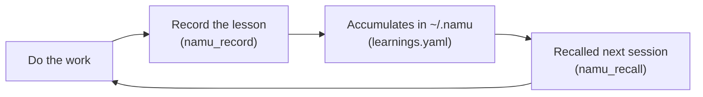

# NAMU Agent System

한국어 문서: [README.ko.md](README.ko.md)

A vendor-independent agent system. NAMU stays independent of any single AI
vendor by centering itself on a portable memory core, accumulating work
records and lessons learned so it keeps improving on its own.

## 📖 New here? Start with the beginner-friendly guides

Just click — no code reading required.

| Guide | When to use it |
|---|---|
| [🌳 NAMU Agent System — The Easy-Read Guide](https://onmiso-hash.github.io/namu-agent/docs/namu_guide.html) (Korean) | You want to get a feel for what NAMU even is |
| [🚀 NAMU Install & Update Guide](https://onmiso-hash.github.io/namu-agent/docs/namu_quickstart.html) (Korean) | You want copy-paste install steps right now |
| [NAMU Install Guide (detailed)](https://onmiso-hash.github.io/namu-agent/docs/install_guide.html) (Korean) | You got stuck installing, or want more depth |
| [🌐 Using NAMU on the Web — Remote MCP Self-Hosting Guide](https://onmiso-hash.github.io/namu-agent/docs/remote_mcp_guide.html) (Korean) | You want to use it only from a browser (claude.ai), without Claude Code/agy |

## What NAMU actually does

NAMU accumulates the lessons an AI agent (Claude Code, agy, etc.) learns
while working into a **portable memory**, so it does better on the next
task. As an AI works through a project it forms judgments — "this bug's
root cause was X", "we designed it this way because Y" — but normally all
of that vanishes once the conversation ends. NAMU permanently keeps it in a
personal folder, `~/.namu`, as an append-only log (a write-only-forward
style where you never edit or delete, only add), so the next session and
even the next project don't repeat the same mistakes. The execution engine
(an AI tool like Claude Code or agy) is just a replaceable part you can
swap at any time — NAMU's real value lives in this memory layer. Getting
started takes one install command — see "30-second start" below.



## ⚡ 30-second start

Claude Code:

```
claude plugin marketplace add onmiso-hash/namu-agent
claude plugin install namu@namu-marketplace
```

agy:

```
agy plugin install https://github.com/onmiso-hash/namu-agent.git
```

Once installed, updating is one line too — say `/namu:update` in a chat
session. It detects which host(s, Claude Code and/or agy) are installed,
updates each one, and re-registers the statusLine automatically.

## Key features at a glance

- **3 tools** — `namu_recall` (fetch recent learnings), `namu_search`
  (keyword-search past learnings), `namu_record` (record a new learning) —
  the AI calls these on its own whenever it needs to during work.
- **3 session surfaces** — a statusLine (an always-on one-liner at the
  bottom of the session), `/namu` (an on-demand session briefing you call
  yourself), and automatic context injection (recent learnings quietly fed
  to the AI at session start) — memory flows in even when you don't go
  looking for it.
- **Multi-PC sync (`namu_sync_setup`)** — lessons learned on your home PC
  can carry over to your work PC, synced through a personal remote repo you
  set up (optional).
- **Web claude.ai connection (remote MCP)** — even without installing
  Claude Code or agy, you can self-host and connect the same memory from
  claude.ai in a browser.

## Identity

NAMU's differentiator isn't the execution engine — it's the **memory layer
(MCP — Model Context Protocol, a standard convention that lets AI call
external tools in a consistent way)**. Execution engines (Claude Code, agy)
are treated as replaceable parts you borrow and can swap out at any time.

This principle is implemented as a "two envelopes, one payload" structure —
the same memory core (`mcp_server.py`), the same worker definitions
(`namu-coder`/`namu-reviewer`), and the same orchestration skill
(`/namu-task`) are shared as-is between the Claude Code and agy engines.
The only thing that differs is the registration format each engine requires
(the "envelope") — for example, MCP server registration has identical
content but Claude Code uses an absolute-path plugin envelope
(`${CLAUDE_PLUGIN_ROOT}`, `.mcp.json`) while agy uses a workspace-relative
envelope (`mcp_config.json`).

## Architecture overview

- **`learnings.yaml`** — the append-only source of truth. Everything
  accumulates in one place, `~/.namu/memory/learnings.yaml`, regardless of
  which project you're running from (namu-35: identical path even when
  running from this dev repo itself), and can be synced across machines via
  a personal remote repo you set up with `namu_sync_setup` (optional).
- **SQLite (FTS5) search cache** — a regenerable local cache indexing
  `learnings.yaml`. It's gitignored, and gets rebuilt automatically on
  server startup whenever a yaml/db entry-count mismatch is detected (e.g.
  after a `git pull`).
- **tasks: a 3-file state layout** — `task.md` (immutable purpose) /
  `context.<machine>.md` (per-machine snapshot, a regenerable view) /
  `log.md` (append-only raw record, the authoritative source).
- **3 MCP tools** — `namu_recall` (fetch recent learnings), `namu_search`
  (FTS5 keyword search, falls back to LIKE for queries under 3 chars), and
  `namu_record` (record a learning; `reason` is required). Only the
  orchestrator calls recall/record — workers never write to memory
  directly.
- **Worker layer** — `namu-coder`/`namu-reviewer` subagents exist twice, once
  per engine's native format (Claude Code `.claude/agents/*.md`, agy
  `.agents/agents/*/agent.md`), but share identical system prompts.
  Orchestration is handled by the `/namu-task` skill
  (`namu-plugin/skills/namu-task/SKILL.md`), which only branches on how
  each engine is invoked (Claude Code = the Agent tool, agy =
  `invoke_subagent`/`send_message` with async wait).
- **3 session surfaces** — three layers coexist.
  - **statusLine**: an always-on one-liner at the bottom of the session
    (`[model] namu-agent | 📌 task · title | context%`). The shared script
    `scripts/namu_statusline.py` is registered in both engines' settings.
  - **`/namu`**: an on-demand slash command you call yourself for a session
    briefing. A read-only command that prints 4 blocks to the screen — the
    active task's progress history, next steps, and recent learnings
    (Claude Code `.claude/commands/namu.md`, agy `.agents/skills/namu/SKILL.md`).
  - **Automatic context injection**: a Claude Code SessionStart hook / agy
    PreInvocation hook quietly injects recent learnings and the active task
    into the model's context at session start (per Claude Code 2.1.0+
    spec, this isn't shown on screen, only fed to the model — on-screen
    visibility is handled by the statusLine and `/namu` instead).

## Folder layout

| Folder | Role |
|------|------|
| `namu-plugin/` | Live code — the MCP memory server (`mcp_server.py`), core logic (`db.py`), config (`config.py`), active-task resolution (`task_resolve.py`), session context builder (`session_context.py`), hooks (`hooks/`), and the orchestration skill (`skills/namu-task/`). This is the plugin envelope body installed into both Claude Code and agy |
| `.claude/` | Claude Code-only glue — native subagents (`agents/namu-coder.md`, `namu-reviewer.md`), the session-briefing slash command (`commands/namu.md`), local settings (`settings.local.json`) |
| `.agents/` | agy-only glue — native subagents (`agents/namu-coder/agent.md`, `namu-reviewer/agent.md`), the session-briefing skill (`skills/namu/SKILL.md`). Per-PC registration files (`hooks.json`, `mcp_config.json`) are gitignored |
| `scripts/` | stdlib-only scripts shared by both engines — `namu_statusline.py` (statusLine), `namu_active_task.py` (active-task selection for `/namu`) |

This repo has no `memory/`, `tasks/`, or `db/` folders (retired by
namu-34/namu-35). Learnings and the search cache always accumulate in the
personal pool `~/.namu/memory/` and `~/.namu/db/`, and task state in
`~/.namu/tasks/<basename(project folder)>/` — no matter where the repo
lives, even while developing this repo itself.

Worker definitions (`.claude/agents/`, `.agents/agents/`) are deliberately
*not* bundled into the plugin envelope. A plain `git pull` on this repo
auto-deploys them across multiple PCs, and editing the files mid-session
hot-reloads on the very next call with no restart needed — this has been
verified in practice (whereas an installed plugin copy is just that, a
copy, and needs a reinstall — see the setup pitfalls below).

## Setup guide

> 🚀 **New here?** Start with the [visual beginner's guide (HTML)](https://onmiso-hash.github.io/namu-agent/docs/namu_quickstart.html)
> (Korean) — install, verify, and update, all copy-paste.
>
> The section below is for cloning this repo to develop it. If you want to
> install NAMU as a plugin into your own project, see the
> [install guide](docs/install_guide.md) (Korean); once installed, see the
> [usage guide — your first day after install](docs/usage_guide.md)
> (Korean) for day-to-day use. If you want to use it **only from a web
> browser (claude.ai)**, without Claude Code or agy, see the
> [remote MCP self-hosting guide](docs/remote_mcp_guide.md) (Korean).

### Prerequisites

- Python 3.12+
- [uv](https://docs.astral.sh/uv/) — the plugin is self-contained via PEP
  723 inline dependencies
- SQLite ≥3.34 (FTS5 support)
- git

### Environment variable

The data root (`~/.namu`) became a **fixed constant** (`NAMU_DATA_ROOT`) as
of namu-35 — there's no environment variable left to point it elsewhere.
Only one variable remains.

- `NAMU_MACHINE` — identifies the current machine. Falls back to the
  hostname if unset (or `unknown` if that's unavailable too). Set it
  explicitly if you use NAMU across multiple PCs, so
  `context.<machine>.md` matching doesn't drift.

**Linux/WSL** — add to your shell profile (`~/.bashrc`, `~/.zshrc`, etc.):

```bash
export NAMU_MACHINE="my-pc"
```

**Windows** — PowerShell doesn't read `.bashrc`, so register it as a
persistent user environment variable instead:

```powershell
[Environment]::SetEnvironmentVariable("NAMU_MACHINE", "my-pc", "User")
```

### Claude Code install

Register using the local path where you cloned this repo:

```
/plugin marketplace add /path/to/namu-agent/namu-plugin
/plugin marketplace update
/reload-plugins
```

After editing `namu-plugin/` code, re-apply it with an update (the install
scope is local, so match it with `--scope local`):

```
claude plugin update namu@namu-marketplace --scope local
```

### agy install

```
agy plugin install ./namu-plugin
```

### Note — updating for installed (GitHub remote) users

The two sections above are for **cloning this repo to develop it** only.
If you installed `namu-plugin` into your own project via a GitHub remote
(the installed form — see the [install guide](docs/install_guide.md),
Korean), you don't need to worry about editing code and re-applying it —
just say `/namu:update` in a chat session. It auto-detects which host(s,
Claude Code and/or agy) are installed, updates each to the latest version,
and re-links the statusLine path automatically when done.

### statusLine registration (both engines)

Claude Code and agy use **different config files**. If you register only
one, the other stays empty forever — you need to register
`scripts/namu_statusline.py` in both.

```json
"statusLine": {
  "type": "command",
  "command": "python -X utf8 /path/to/namu-agent/scripts/namu_statusline.py",
  "enabled": true
}
```

## Setup pitfalls

A short list of gotchas hit in practice. Read #1 and #2 first if you're on
non-English Windows.

**1. Non-English (e.g. Korean) Windows native: cp949 emoji encoding kills
the statusLine**
The default codepage on Korean Windows is cp949. When Claude Code invokes
the statusLine script through a pipe, stdout gets forced into cp949, which
can't encode the emoji (📌 etc.) the script prints — the script crashes
with a `UnicodeEncodeError` and the bottom bar looks empty. Run the same
script directly in a terminal, though, and it works fine — the terminal's
stdout is UTF-8, but the pipe the engine invokes follows the system locale
(cp949) instead. The fix is to force Python's UTF-8 mode with
`python -X utf8` (or `PYTHONIOENCODING=utf-8`), which is already reflected
in the statusLine registration example above.

**2. Legacy conhost terminals: emoji render as `�` (not an encoding bug)**
If the statusLine does show up but the emoji slot is a broken glyph (`�`),
that's not an encoding issue — it's **terminal rendering**. Old-style
conhost windows can't draw color emoji. Switching to Windows Terminal or
the VS Code integrated terminal fixes it immediately.

**3. agy's plugin envelope is workspace-relative-path based — running
outside the repo has limits**
agy's plugin envelope (`mcp_config.json`/`hooks.json`) doesn't correctly
resolve variable substitutions like `${extensionPath}`, so it's registered
with workspace-relative paths (`namu-plugin/mcp_server.py`, etc.) instead.
That means paths only resolve correctly if agy opens this repo as its
workspace — open the repo as the workspace before running it.

**4. Installed plugin copies are, well, copies — reinstall/update is
required after editing `namu-plugin/`**
Both Claude Code (`claude plugin update ...`) and agy
(`agy plugin install ./namu-plugin`) **copy** files to a separate location
on install. So editing code inside `namu-plugin/` keeps the old code
running until you reinstall/update. Workspace files, on the other hand —
the worker definitions (`.claude/agents/`, `.agents/agents/`) — auto-load
with a plain `git pull` and hot-reload on the very next call even when
edited mid-session, with no restart or reinstall needed.

## Roadmap

- **Phase 1 (current):** Complete the personal-use system
- **Phase 2:** Public release + personal memory integration
- **Phase 3:** A public memory pool (community collective intelligence,
  optional contribution/subscription)

## Acknowledgments

NAMU's plugin-style packaging was inspired by the *MultiAgent Korean Manual v2.1*
from [netwaif/multi-agent-starter](https://github.com/netwaif/multi-agent-starter).

## License

Apache-2.0. See [LICENSE](LICENSE).
