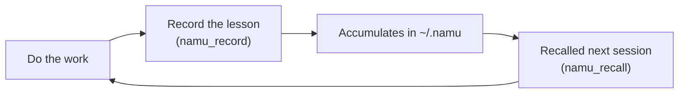

# NAMU Agent System

한국어 문서: [README.ko.md](README.ko.md)

A vendor-independent agent system. NAMU stays independent of any single AI
vendor by centering itself on a portable memory core, accumulating work
records and lessons learned so it keeps improving on its own.

## 📖 Guides — start here

Just click — no code reading required. The guides are written in Korean.

| Guide | When to use it |
|---|---|
| [🌳 **NAMU Guide**](https://onmiso-hash.github.io/namu-agent/docs/index.html) | What NAMU is, and how the four ways of using it differ |
| [🔧 Install](https://onmiso-hash.github.io/namu-agent/docs/install_guide.html) | Attach it to Claude Code / agy — install, first task, update, uninstall |
| [☁️ **NAMU Cloud**](https://namu-cloud.onnamu.kr/) | Attach memory to a browser AI — no install, just a GitHub login |
| [🌐 Self-host it on the web](https://onmiso-hash.github.io/namu-agent/docs/remote_mcp_guide.html) | Browser route, but you run the server yourself |
| [📐 Memory architecture](https://onmiso-hash.github.io/namu-agent/docs/memory_architecture.html) | Where memory lives and what shape it takes |
| [⚙️ Workflow architecture](https://onmiso-hash.github.io/namu-agent/docs/workflow_architecture.html) | The other half — how work is ordered, and where it stops for you |
| [📎 File attachments](docs/attach_files.md) | Uploading/downloading files to your own repo, and the isolation rule you must not break |
| [🔎 Unified search](docs/search_index_unify.md) | How all five bowls ended up behind one SQLite index |

## What NAMU actually does

NAMU accumulates the lessons an AI agent (Claude Code, agy, etc.) learns
while working into a **portable memory**, so it does better on the next
task. As an AI works through a project it forms judgments — "this bug's
root cause was X", "we designed it this way because Y" — but normally all
of that vanishes once the conversation ends. NAMU permanently keeps it in a
personal folder, `~/.namu`, as an append-only log, so the next session and
even the next project don't repeat the same mistakes.

The execution engine (Claude Code, agy) is just a replaceable part you can
swap at any time — NAMU's real value lives in this memory layer.


```mermaid
flowchart LR
    A[Do the work] --> B["Record the lesson<br/>(namu_record)"]
    B --> C["Accumulates in ~/.namu"]
    C --> D["Recalled next session<br/>(namu_recall)"]
    D --> A
```

## Support status — where you can use NAMU today

NAMU is two halves — **memory** (5 bowls + task journals + file attachments) and
**the working procedure** (session briefing, `/namu-task`, workers, statusLine,
guard hooks). Memory attaches anywhere that accepts an MCP address; the
procedure needs a **host-specific plugin envelope** built for it.

| Client | How it attaches | 🧠 Memory | ⚙️ Working procedure | |
|---|---|---|---|---|
| **Claude Code** (terminal) | plugin | full (14 tools) | full | ✅ supported |
| **agy** (terminal, Antigravity CLI) | plugin | full (14 tools) | nearly full — only the 2 guard hooks are missing | ✅ supported |
| **claude.ai** (web) | MCP address | full (5 bowls + journals + attachments, 10 tools) | not yet | ✅ supported |
| ChatGPT · Gemini (web) · Copilot · Cursor, etc. | — | not yet | not yet | ⏳ not wired up |

- **"Not yet" does not mean the client can't do it — it means NAMU hasn't taken
  that seat yet.** Memory works in principle with any client that can add a remote
  MCP server (claude.ai is the one we've confirmed); the procedure needs a per-host
  envelope, and so far only Claude Code and agy have one.
- **Guard hooks** = blocking a close-out that forgot the `[다음]` line (Stop) +
  re-injecting standing reminders (UserPromptSubmit). agy has no matching events,
  so only these two are missing (namu-62). Its session briefing ships separately
  as a PreInvocation hook and does work.
- Over an MCP address 10 of the 14 tools are exposed: the three memory tools
  (`namu_recall`/`namu_record`/`namu_search`) plus the seven attachment tools.
  Removing sticky notes, bookmarks, and sync setup are plugin-only — but all
  five bowls and the task journals are fully readable and writable.
- The Claude Code row was measured directly (same folder, plugin on vs. off);
  the agy row reflects what the plugin ships.

## ⚡ 30-second start

```
claude plugin marketplace add onmiso-hash/namu-agent
claude plugin install namu@namu-marketplace
```

For agy: `agy plugin install https://github.com/onmiso-hash/namu-agent.git`.
Updating is one line too — say `/namu:update` in a chat session.

Full steps, verification, and troubleshooting live in the
[install guide](https://onmiso-hash.github.io/namu-agent/docs/install_guide.html).

## Identity

NAMU's differentiator isn't the execution engine — it's the **memory layer
(MCP — Model Context Protocol)**. This principle is implemented as a
"two envelopes, one payload" structure: the same memory core
(`mcp_server.py`), the same worker definitions
(`namu-coder`/`namu-reviewer`), and the same orchestration skill
(`/namu-task`) are shared as-is between Claude Code and agy. The only thing
that differs is the registration format each engine requires.

## Architecture overview

- **Five bowls** — learnings (`learnings.yaml`), personal facts
  (`profile.yaml`), task journals (`tasks/<project>/log.md`), sticky notes
  (`memo.yaml`), and the attachment log (`attachments.yaml`). Every entry has
  the same three layers: `summary` (what), `reason` (why), `body` (what
  actually happened). Only the sticky notes bowl is erasable; the rest are
  append-only.
- **Source of truth** — everything under `~/.namu`. The data root is a fixed
  constant, so it is the same path no matter which project you run from
  (namu-35).
- **SQLite (FTS5) search cache — all five bowls.** Learnings keep their own
  table (`learnings` + `learnings_fts`); the other four each get an
  identically shaped pair (`bowl_<name>` + `bowl_<name>_fts`, trigram). It is
  gitignored and fully regenerable from the source files. Staleness is judged
  per bowl by one signature over its source files' size and mtime, so only the
  bowl that actually changed is rebuilt (session start, server boot, and right
  after a pull). Queries are **AND across whitespace-separated tokens**; a
  query containing a token under 3 characters skips the index and falls back
  to a full LIKE scan, because trigram cannot match two characters at all.
- **Task state, two files** — `task.md` (immutable purpose) and `log.md`
  (append-only, authoritative). "What's next" is the last `[다음]` line;
  the only lines that close a task are `[완료]` and `[중단]`. Searching the
  tasks bowl returns log lines **and** each task's brief as one whole entry
  tagged `설명서`.
- **File attachments** — files go into `attach_file/` in *your own* synced
  repo, never onto a NAMU server. That folder is sparse-checkout isolated on
  each PC so the bodies never come down, while the attachment log travels
  everywhere. One-time ticket URLs let a file body move without passing
  through the AI's output at all. **File sizes are always read from the
  attachment log, never asked of the repository** — asking git makes it fetch
  every missing body and the isolation collapses.
- **14 MCP tools** — memory: `namu_recall`, `namu_search`, `namu_record`,
  `namu_memo_remove`, `namu_task_pin`, `namu_task_unpin`, `namu_sync_setup`;
  attachments: `namu_upload_file`, `namu_list_files`, `namu_download_file`,
  `namu_delete_file`, `namu_create_upload_ticket`,
  `namu_create_download_ticket`, `namu_check_ticket`. Remote MCP exposes 10 —
  everything except the four plugin-only tools (`namu_memo_remove`,
  `namu_task_pin`, `namu_task_unpin`, `namu_sync_setup`).
- **Worker layer** — `namu-coder`/`namu-reviewer` subagents exist in each
  engine's native format with identical system prompts. The `/namu-task`
  skill orchestrates them.
- **Session surfaces** — statusLine (always-on one-liner), `/namu`
  (on-demand briefing), and automatic context injection at session start.

Details: [memory architecture](https://onmiso-hash.github.io/namu-agent/docs/memory_architecture.html).

## Folder layout

| Folder | Role |
|------|------|
| `namu-plugin/` | Live code — MCP memory server (`mcp_server.py`), core logic (`db.py`), config (`config.py`), hooks (`hooks/`), orchestration skill (`skills/namu-task/`) |
| `.claude/` | Claude Code glue — native subagents, session briefing command, local settings |
| `.agents/` | agy glue — native subagents, session briefing skill |
| `scripts/` | Stdlib-only scripts shared by both engines — statusLine, active-task lookup, docs CSS sync |
| `docs/` | Guides (HTML, published via GitHub Pages) and design docs (md). Superseded documents live in `docs/archive/` |

This repo has no `memory/`, `tasks/`, or `db/` folders (retired by namu-34
and namu-35). Everything accumulates under the personal pool `~/.namu` —
regardless of where the repo sits, including while developing this repo
itself.

Worker definitions are deliberately not bundled into the plugin envelope: a
`git pull` deploys them across machines, and edits hot-reload mid-session
without a restart.

## Development setup

For working on NAMU itself.

```
git clone https://github.com/onmiso-hash/namu-agent.git
claude plugin marketplace add /path/to/namu-agent/namu-plugin
claude plugin install namu@namu-marketplace
sh scripts/setup_dev_hooks.sh
```

- **Requirements** — Python 3.12+ · [uv](https://docs.astral.sh/uv/) ·
  SQLite ≥3.34 (FTS5) · git
- **Environment variables** — only `NAMU_MACHINE` (this PC's identifier;
  falls back to the hostname). The data root is a fixed constant and cannot
  be overridden.
- **Version bumps** — always use `scripts/namu_bump.py <version>`.
  `setup_dev_hooks.sh` installs a pre-push hook that blocks version drift.
- **Docs styling** — the guides' CSS is derived from the NAMU Cloud site.
  Re-derive it with `python3 scripts/sync_docs_css.py` when that design
  changes.

## Roadmap

- **Phase 1 (done):** complete the personal system
- **Phase 2 (in progress):** public distribution, personal memory sync, NAMU Cloud
- **Phase 3:** a public memory pool (community collective intelligence,
  opt-in contribution/subscription)

## Acknowledgments

NAMU's plugin-style construction was inspired by the "MultiAgent Korean
Manual v2.1" from
[netwaif/multi-agent-starter](https://github.com/netwaif/multi-agent-starter).

## License

Apache-2.0 — see [LICENSE](LICENSE).
