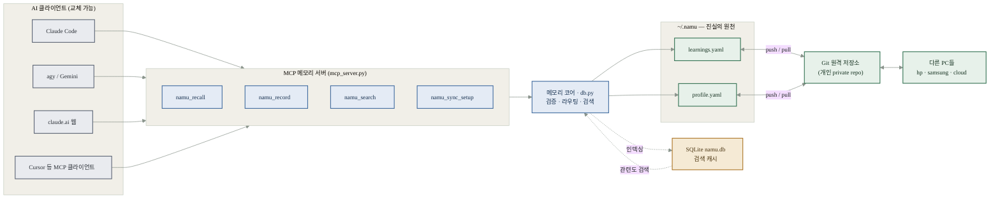
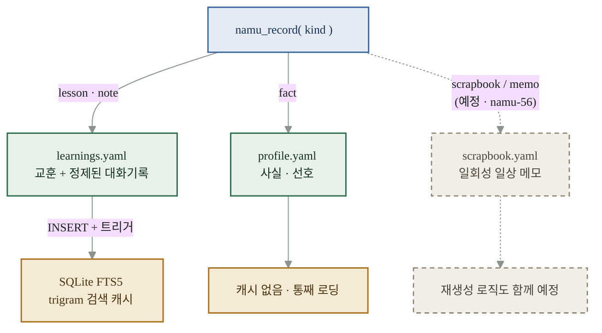
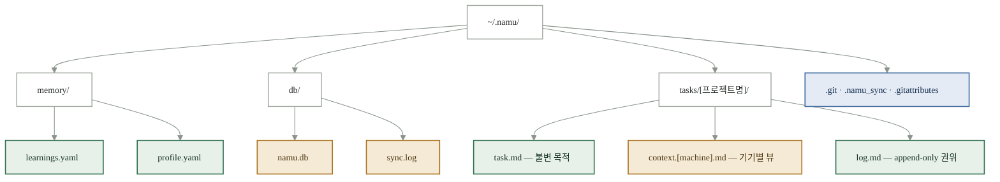
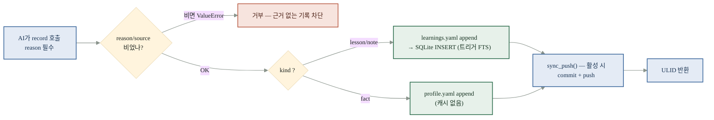
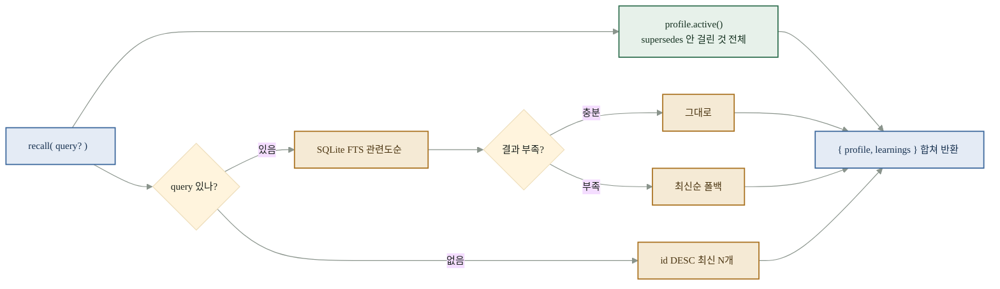
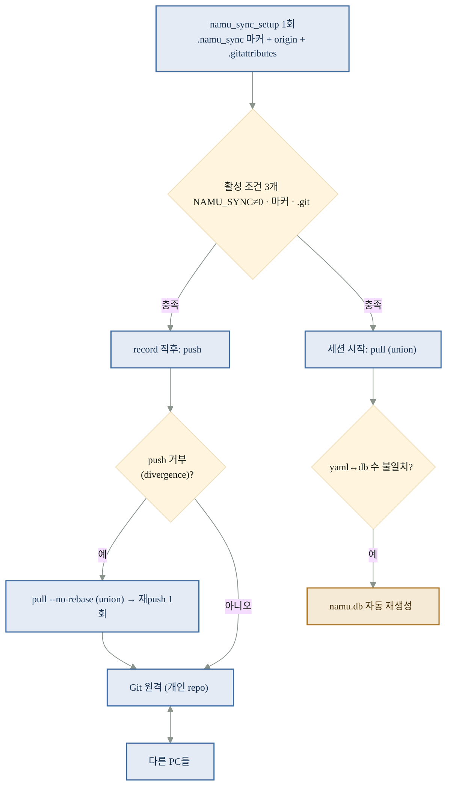
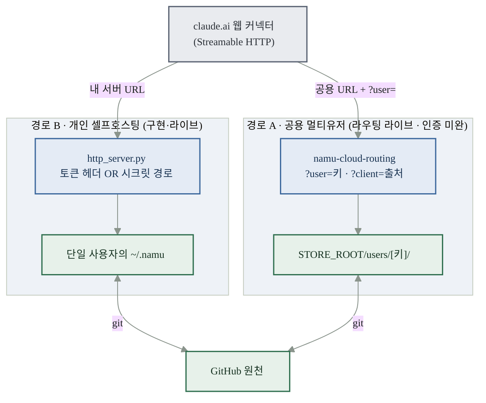

# NAMU 기억 시스템 설계도

> 🌳 머신마다 · AI마다 · 기억의 종류마다 남기는 방법과 사는 곳이 어떻게 다른지를 한 장에 펼친 시각 설계도.
> **근거:** `namu-plugin/config.py` · `namu-plugin/memory_sync.py` · `namu-plugin/db.py` · `docs/mcp_memory_design.md` · `docs/remote_mcp_design.md`
> **코드 기준 시점:** 2026-07 · 예정 항목(scrapbook 제3그릇)은 namu-56 진행 중(미구현)
>
> 웹페이지 버전(자체 완결 HTML): [`memory_architecture.html`](./memory_architecture.html)

---

## 00 · 이 문서의 색 약속 (범례)

색이 곧 성격입니다. 아래 다섯 갈래만 기억하면 이후 모든 다이어그램이 같은 규칙으로 읽힙니다.

| 색 | 갈래 | 뜻 |
|---|---|---|
| 🟩 초록 | **진실의 원천 · 동기화** | append-only YAML. Git으로 PC 간 공유. 지우거나 고치지 않음 |
| 🟧 주황 | **로컬 캐시 · 재생성** | 기기 종속. gitignore. 언제든 원천에서 다시 만들어짐 |
| 🟦 파랑 | **네트워크 · 원격** | MCP 서버·터널·클라우드 컨테이너 등 전송/호스팅 계층 |
| ⬜ 회색 | **AI 클라이언트 · 엔진** | Claude Code·agy·웹 등. 빌려 쓰고 교체 가능한 부품 |
| ⬛ 점선 | **예정 · 미구현** | 설계는 확정, 코드는 아직 (예: 제3그릇 scrapbook) |

---

## 01 · 전체상 — 어떤 AI가 붙어도, 바라보는 기억은 하나

NAMU의 독립성은 인터페이스가 아니라 **메모리 레이어(MCP)** 에 있습니다. Claude Code·agy·웹 Claude 등 실행 엔진은 전부 같은 MCP 서버를 통해 같은 `~/.namu` 기억 풀을 읽고 씁니다. 엔진은 교체돼도 기억은 그대로 누적됩니다.

> **핵심 문장:** "NAMU는 AI 모델이 아니라, MCP를 지원하는 AI 클라이언트를 지원한다. AI는 바뀌어도 기억은 하나다."
> 도구가 4개인 이유는 `recall`·`record`·`search`에 동기화 설정 `sync_setup`이 더해지기 때문입니다. (웹 커넥터에는 앞의 3개만 노출)

---

## 02 · 세 개의 축 — "다르게 남긴다"는 세 축이 겹쳐 있다는 뜻

기억이 달라지는 방향은 딱 세 가지이며, 서로 직교(independent)합니다. 하나의 기록은 세 축의 좌표를 동시에 갖습니다. 예: *"hp 머신에서 · Claude Code가 · 교훈(lesson)으로"* 남긴 한 줄.

| 축 | 이름 | 무엇이 갈리나 | 필드 |
|---|---|---|---|
| **A** | 기억의 종류 (그릇) | 교훈·대화기록은 검색 컬렉션으로, 사실·선호는 통째 로딩하는 작은 요약본으로 | `kind` = lesson · note · fact *(+ scrapbook 예정)* |
| **B** | 어느 기기에서 | PC마다 스냅샷·작업 컨텍스트는 따로 쌓이되, 원천 풀은 Git으로 합류 | `machine` = hp · samsung · web · cloud … |
| **C** | 어느 AI·엔진이 | 누가 남겼는지는 출처 태그로. 실행 엔진은 부품이라 풀은 엔진별로 안 나뉨 | `via` / `client` = claude · agy · web … |

> **왜 통합하나?** namu-35 결정 — "개발 모드/설치 모드" 구분을 폐지하고 데이터 루트를 `~/.namu` 하나로 고정했습니다. 어느 프로젝트에서 실행하든, 어느 엔진으로 실행하든 교훈은 한 풀에 모입니다. 분기(branching)가 없으니 오배선도 구조적으로 불가능합니다.

---

## 03 · 그릇 (Axis A 상세) — 지금은 두 그릇, 곧 세 그릇

`namu_record`는 **도구 하나**지만 `kind` 파라미터로 서로 다른 그릇에 라우팅합니다. 웹 커넥터의 3-도구 제약 때문에 도구 수를 늘리지 않고, 라우팅으로 그릇을 나눈 설계입니다.

| 그릇 | kind | 담는 것 | 접근 패턴 | SQLite 캐시 | 정정 방식 |
|---|---|---|---|---|---|
| **learnings.yaml** 🟩 | `lesson` / `note` | 일반화할 교훈 + 정제된 대화기록 | 검색 컬렉션 — FTS로 관련도순/최신순 일부만 | 있음 (namu.db, 재생성) | append-only. 각 항목이 독립 사실 |
| **profile.yaml** 🟩 | `fact` | 사용자·환경에 관한 사실·선호 | 통째 로딩 — 활성 항목 전체 반환 | **없음** (작아서) | append + `supersedes` 포워드 포인터 |
| **scrapbook.yaml** ⬛ | `scrapbook`/`memo` | 영화 시간표 같은 일회성 일상 메모 | (설계 진행 중) | (예정) | **namu-56 · 미구현** |

> **⚑ 왜 세 번째 그릇이 필요한가:** "영화 시간표"처럼 일회성 정보를 저장하라고 지시하면, 지금은 마땅한 그릇이 없어 `learnings.yaml`(엔지니어링 지식베이스)이 오염됩니다. 이를 막기 위한 전용 서랍이 **namu-56**으로 등록돼 있습니다. — *진행 중, 아직 코드로는 존재하지 않습니다.*

### recall vs search — 같은 query, 다른 목적

- **recall** = 작업 **시작 전 맥락 로딩**. "뭐라도 준다" — 매칭이 약하면 최신순으로 폴백. `profile` 전체 + `learnings` 검색결과를 `{profile, learnings}` 한 dict로 반환.
- **search** = 판단 중 **패턴 분석**. 정확히 매칭되는 것만, 없으면 빈 결과 + 항상 `{success, failure, partial}` 경향 요약 첨부. (learnings 전용 — profile은 검색 대상이 아님)

---

## 04 · 저장 지도 (Axis B 상세) — 모든 것이 사는 곳: `~/.namu`

학습 기억이든 작업 상태든, 물리적으로는 전부 개인 풀 `~/.namu` 아래 한곳에 모입니다. 무엇이 Git으로 공유되고(초록), 무엇이 기기에만 남는 캐시인지(주황)를 색으로 구분해 보세요.

- **Git으로 공유(PC 간 합류):** `learnings.yaml` · `profile.yaml` · tasks의 `log.md`·`.project`. `.gitattributes`의 `merge=union` + ULID 키 덕분에 오프라인 다중 PC 병합 충돌이 0.
- **기기에만(재생성 캐시):** `db/`는 gitignore 대상. `namu.db`는 yaml↔db 항목 수가 어긋나면 서버 부팅 시 자동 재생성. `context.[machine].md`는 `log.md`로부터 다시 그릴 수 있는 뷰.
- **두 갈래로 나뉜 성격:** **개인전역지식** = `memory/*.yaml`(프로젝트 무관 한 풀). **프로젝트상태** = `tasks/[basename(프로젝트)]/`. 저장 위치는 같은 `~/.namu`지만 귀속 기준이 다릅니다.

---

## 05 · 흐름 — 쓰기 · 읽기 · 동기화가 도는 방식

### ① 기록 흐름 — `namu_record`

원천 먼저, 캐시 나중, 그리고 자동 push.

### ② 조회 흐름 — `namu_recall`

두 그릇을 합쳐 맥락으로 반환.

### ③ 동기화 흐름 — 다중 PC 합류

record 직후 push, 세션 시작 시 pull. 충돌은 union 병합으로 구조적으로 녹임.

> **✦** 동기화는 **선택 기능**입니다 — `namu_sync_setup`으로 명시 활성화하기 전엔 전부 로컬에만 남습니다. 원격 repo는 사용자가 미리 준비한 **개인 private repo**이며, 함수는 로컬 wiring만 담당합니다.

---

## 06 · 머신·AI별 차이 (Axis B·C) — 같은 풀에 남되, 출처는 필드로 새긴다

기억 풀은 하나지만, 각 항목에는 "어느 기기에서 · 누가" 남겼는지가 필드로 박힙니다. 나중에 `GROUP BY machine`이나 태그로 기계적 추출이 가능하도록 설계된 구조입니다.

| 필드 | 축 | 어떻게 정해지나 | 예시 값 | 쓰임 |
|---|---|---|---|---|
| `machine` | B · 머신 | `.env`의 `NAMU_MACHINE` → 없으면 호스트명 → `unknown` | `hp · samsung · web · cloud` | 기기별 통계·컨텍스트 분리 |
| `via` / `client` | C · AI | 기록한 엔진이 주입 (웹 라우팅은 `?client=`) | `claude · agy · web` | 어느 AI가 남겼나 (출처 태그) |
| `verified_by` | 검증 | 기록 시 지정 (백필 불가) | `human · ai · unverified` | "사람이 검증한 것만" 필터 |
| `id` | 정렬 | 서버가 ULID 자동 생성 | `01KY4F…` | 시간순 정렬 + 머지 충돌 0 |

- **머신 (B):** `context.[machine].md`는 PC마다 따로 — 재생성 가능한 뷰. 권위는 공유되는 `log.md`. `NAMU_MACHINE`은 `.env`에 PC별로 한 번만 설정.
- **AI (C):** 기본 워커 = 메인 AI의 네이티브 서브에이전트(추가 비용 0·보안). 외부 엔진(agy·Gemini)은 설치/작업 시 고르는 override. 선택값은 `namu_workers.yaml`에.
- **불변식:** 어느 프로젝트·어느 엔진에서 기록하든 한 풀로 통합(namu-35). 나중에 공개 커뮤니티 풀이 생기면 task명·태그로 기계 추출하도록 설계됨.

---

## 07 · 원격 MCP — 개인 · 공용, 기억을 네트워크 너머로 여는 두 경로

stdio 로컬 서버가 기본이지만, 웹 Claude(claude.ai) 같은 원격 클라이언트를 붙이려면 HTTP로도 서빙해야 합니다. 여기에 두 갈래가 있습니다 — **경로 B(개인 셀프호스팅)** 는 구현·라이브, **경로 A(공용 멀티유저)** 는 라우팅까지 라이브·인증은 미완입니다.

- **경로 B · 개인 (두 배포 형태):** ① 자기 PC 상시구동 + 터널(cloudflared)로 공개 HTTPS — 지금 쓰는 그 `~/.namu` 그대로. ② 클라우드 컨테이너(Railway 등) — 부팅 시 GitHub에서 clone. 인증은 토큰 헤더 또는 시크릿 경로.
- **경로 A · 공용 (지금은 "협조적 격리"):** `?user=키`로 `users/[키]/` 서랍에 라우팅. 다만 `?user=`는 **인증이 아니라 위조 가능한 라벨** — 공유 시크릿을 아는 사람은 남의 키도 지정 가능. 일반 공개엔 부족합니다.
- **미래 (신원을 URL → 토큰으로):** OAuth 2.1 도입 시 신원이 URL에서 빠지고 사용자별 `Bearer` 토큰으로 이동 → 남의 서랍 접근이 구조적으로 차단. `?client=`(어느 AI)는 별개 축이라 그대로 유지.

> **⚑ 웹의 한계:** 원격으로 여는 건 *메모리 코어(레이어 C)뿐*입니다. 자동 세션 브리핑·`/namu-task`·서브에이전트(레이어 B)는 Claude Code 전용 글루라 웹에서 동작하지 않습니다. tasks 도구도 웹엔 노출하지 않습니다 — 웹 노출은 `recall·record·search` 3종뿐.

---

## 08 · 흔들리지 않는 원칙 — 이 설계가 지키는 여섯 가지

1. **독립성은 메모리 레이어에** — 인터페이스가 아니라 MCP에 포터블하게. 실행 엔진은 빌려 쓰고 교체 가능한 부품.
2. **원본이 곧 기억** — `learnings.yaml`이 진실의 원천(append-only). SQLite는 재생성 가능한 캐시일 뿐.
3. **append-only 로그** — `learnings.yaml`과 작업 `log.md`는 수정·삭제하지 않는다. 정정은 새 항목으로.
4. **승인 게이트** — 워커 호출 전, 검수 fail 후 재실행 전 반드시 사용자 확인. 자동 재실행 금지.
5. **판단 이유 기록** — 결과만이 아니라 `reason`(왜)까지. 근거 없는 기록은 `ValueError`로 차단.
6. **데이터 루트 고정** — `~/.namu` 고정 상수 — 환경변수로도 못 바꿈. 분기가 없으니 오배선도 불가능.
